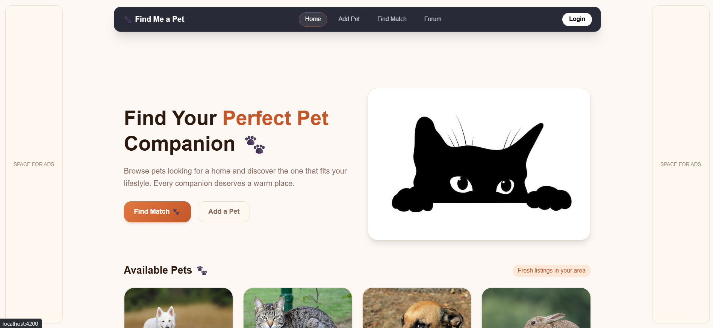
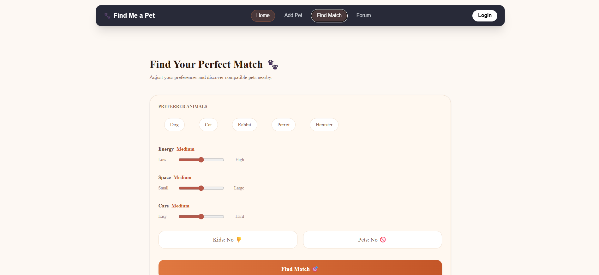
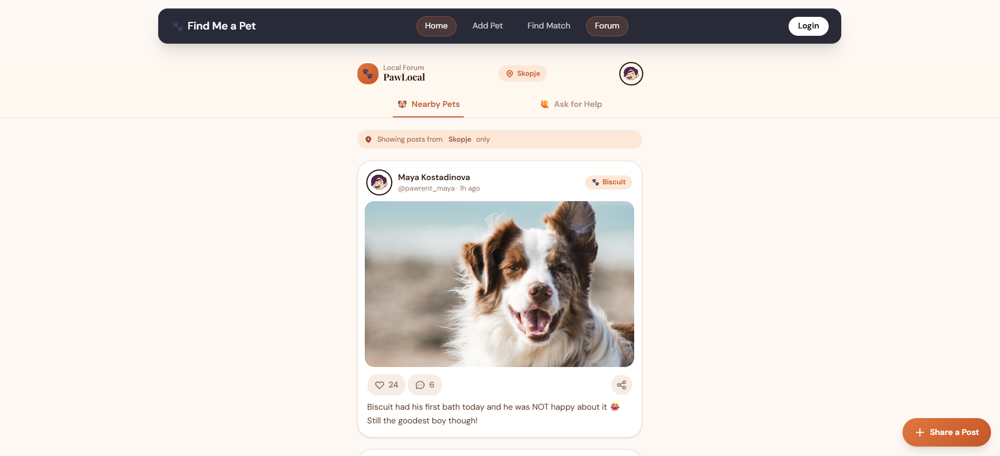

# Find Me a Pet – Smart Pet Matching Platform

## Screenshots

  

### Home Page

  

### Pet Feed / Match Page

  

### Pet Details / Forum

---

## Overview

Full-stack pet adoption platform with smart matching and location-based feed.

Backend is currently only a Clean Architecture scaffold (no logic implemented yet). Frontend is functional and ready for API integration.

---

## Project Status

- Backend: Structure only (Clean Architecture)
- Frontend: Working UI, API-ready
- Database: Not implemented yet

---

## Features (Planned)

- Pet browsing with filters/search
- JWT authentication (User/Admin)
- Pet CRUD + image upload
- Smart matching system
- Location-based feed (local only)
- Likes and comments
- Infinite scroll feed

---

## Location-Based Feed

No global social network.

Users see posts only from:
- Same city OR
- Within a radius (e.g. 20 km)

Example API:

GET /api/posts?lat=...&lng=...&radius=20

---

## Tech Stack

Backend:
- ASP.NET Core (.NET 8)
- Entity Framework Core
- SQL Server
- JWT Auth

Frontend:
- Angular
- Reactive Forms
- HTTP Interceptors

Architecture:
- Clean Architecture (Domain, Application, Infrastructure, API)

---

## Project Structure

find-me-a-pet/
├── backend/ (scaffold only)
├── frontend/
├── docs/
└── README.md

---

## Run Frontend

cd frontend/find-me-a-pet-ui
npm install
ng serve

App runs on:
http://localhost:4200

---

## Backend

Only architecture structure exists. No implementation yet.

Future work includes full API, database, authentication, and matching system.